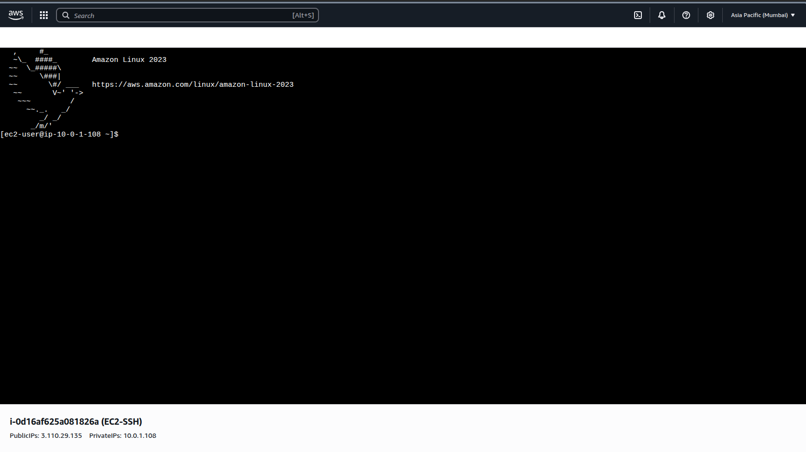

# Project 1: Launch EC2 & SSH Connect

## Objective
Launch an EC2 instance, generate a key pair, and connect to the instance using SSH.

## Steps
1. Launch EC2 (Amazon Linux / Ubuntu).
2. Create & download key pair.
3. Connect to EC2 via SSH.
   ```bash
   ssh -i Naman.pem ec2-user@3.110.29.135

## Screenshot
- Successful SSH connection

